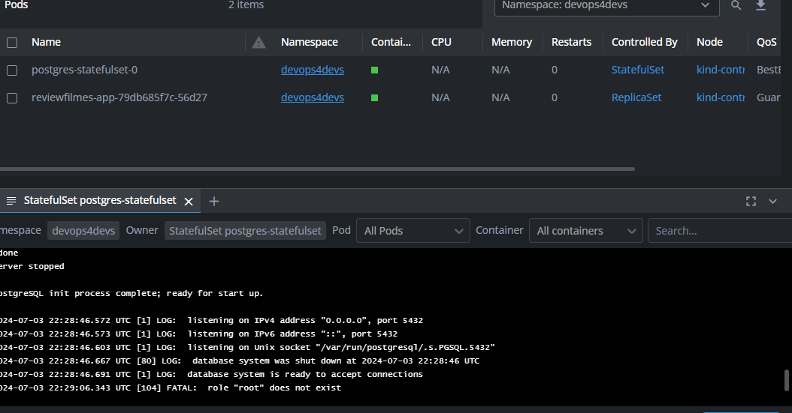

# Propriedades do ambiente

- Ao invés de usar o K3D, escolhi usar o Kind. Já estou contextualizado, e é mais facil pra mim seguir usando o Kind atualmente.


- Os arquivos estão dentro da pasta kubernetes, que dentro dela, possui outros  subdiretórios:
    pasta 1: database
    pasta 2: appication


# Kind + Intgress Nginx
Resolvi também subir o ingress controller, afim de facilitar o acesso local  esta applicação. Para isso foi neessário confgurar primeiramente no Kind a compatibilidade com o Ingress, conforme a documentação do próprio Kind.

Acesse: https://kind.sigs.k8s.io/docs/user/ingress/

```bash 
cat <<EOF | kind create cluster --config=-
kind: Cluster
apiVersion: kind.x-k8s.io/v1alpha4
nodes:
- role: control-plane
  kubeadmConfigPatches:
  - |
    kind: InitConfiguration
    nodeRegistration:
      kubeletExtraArgs:
        node-labels: "ingress-ready=true"
  extraPortMappings:
  - containerPort: 80
    hostPort: 80
    protocol: TCP
  - containerPort: 443
    hostPort: 443
    protocol: TCP
EOF
```

1 - Criando o Namespace. Na raiz, um aquivo de definição do namespace.

```bash
kubectl apply -f ./namespace.yaml
```

2- Aplicando todos os manifestos do banco de dados dentro da basta database.

 - Diferente do da aplicação, iremos subir um objeto do tipo statefulset. O stetefulset vai nos ajudar a garantir que a aplicação não perca os dados sensiveis em caso do banco ser reiniciado. Esse objeto é usado exclusivamente por aplicações que possuem estado, por isso escolhemos essaestratégia para o banco.

 - Presentes na pasta estão os arquivos:
   
   **statefulset.yaml**: Contém as configurações para implantar o banco postgres local em nosso kubernetes. Inclusive, importa o secret com usuário e senha de acesso ao banco.<br/>

   **secrets.yaml**:service.yaml**


Comando:
```bash
kubectl apply -f ./database*
```

3 - Subindo os manifestos da aplicação dentro da pasta application.

 - Presentes na pasta estão os arquivos:
 
   **deployment.yaml**: Contém todas as configurações para subir a aplicação com apenas 1 réplica.<br/>

   **service.yaml**: Contém as configurações para expor a aplicação.<br/>

   **ingres.yaml**: Contém a configuração do nginx controller, afim de facilitar o acesso a applicação.<br/><br/>

Comando:
```bash
kubectl apply -f ./application*
```

Aplicação no K8S Lens:



Aplicação rodadando no localhost:


